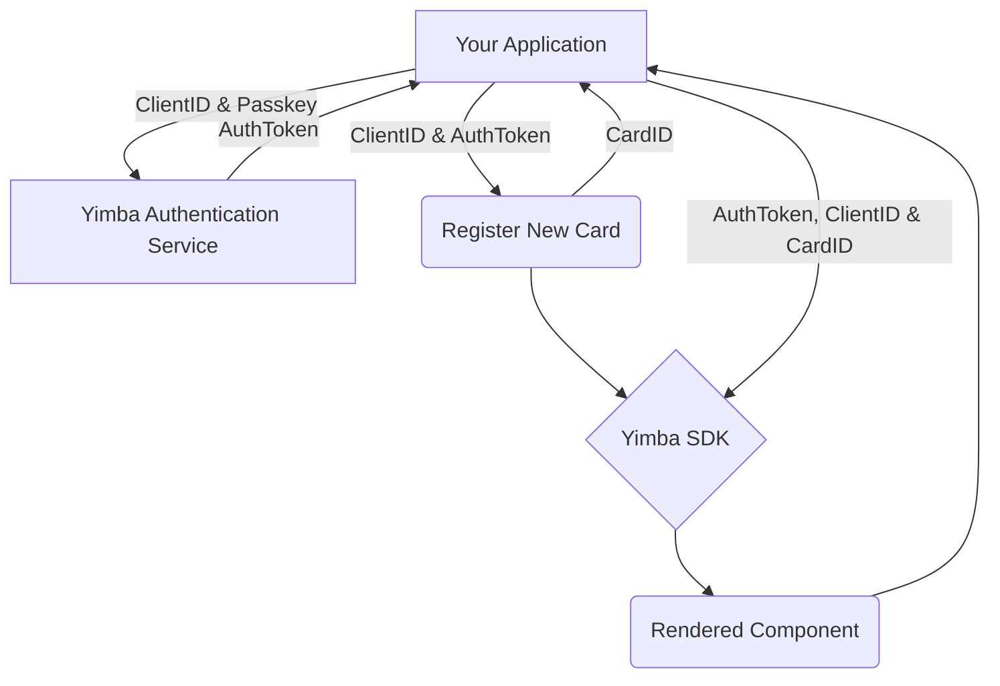

# Yimba SDK Documentation

## Introduction

This document describes the use and integration of the Yimba SDK into your application. The Yimba SDK provides quick and simple integration to new or existing applications allowing you to build a digital mobile wallet with only 5 lines of code! The Yimba SDK returns prebuilt components to your UI within a single line of code.

## SDK Installation

The SDK can be installed via NPM using standard methods.

**Using NPM**

    $ npm i yimba-sdk

**Using Yarn**

    $ yarn add yimba-sdk

## Available Components

|Component Name|Function  |
|--|--|
| **YimbaHeader** | Displays a configurable header component allowing you to customise the Title, Iconography and Function of buttons. |
| **YimbaCard** | Displays a Payment Card Preview with any currently applied Card Customisation. |
| **YimbaDesigns** | Displays all available card customisation options available to your card program. This component contains the Yimba Card Component that will dynamically re-render allowing new card art to be previewed before being applied |
| **YimbaDesignHistory** | Displays all previously set card art designs for a given payment card. |

## SDK Overview

In order to use the Yimba SDK, you will need to have been issued your unique **Authentication Identification, Client Identification and Passkey**. You **will not** be able to make use of the Yimba SDK without these elements being issued by Yimba. The below diagram gives you a basic overview of the process when utilising the SDK.

### Basic SDK Overview



### Process Overview

Your application must first call the Yimba Authentication Service passing both your **AuthenticationID** and **PassKey** with the request. The authentication service will issue a bearer token that will be valid for 24 hours. The Token Request method (**requestToken**)  will return a promise holding the token data for you to manage within your application.

**Obtain Auth Token**
```javascript

    import { requestToken } from 'yimba-sdk';
    
    _yourFunctionName(authenticationID, clientSecret) {
        requestToken(authenticationID, clientSecret).then((authToken) => {
    	    // handle the response as required within your app. For example, 
    	    // call a dispatch to Redux to store the token
    	    this.props.setAPIToken(authToken);
    	})
    }

```
##

If you are making a call to a Yimba Component and have not yet obtained a valid CardID, then you will need to request for a new card to be registered. When making this call, the Yimba SDK will return an identifier for the card registration. The Registration method requires both your issued **ClientID** and **AuthToken** as well as the Bin Range for the card. You can pass an optional JSON array for the **DefaultCardImage** to display the preset default card image prior to customisation. The **DefaultCardImage** array has the following available properties:-

|PropName|PropType  | Notes|
|--|--|--|
| **ImageName** | string | e.g 'My Default Image'|
| **ImageType** | DefaultImageType | one of the available values from **DefaultImageTypes** within the Yimba SDK, e.g. 'URL' or 'BASE64'
| **ImageData** | string | Image data as a string. Either the given image URL or its BASE64 encoded data|

**Example Default Image Array**

*Passing Image as URL*
```javascript
[
	{
		"ImageName": "My Default Image",
		"ImageType": "URL",
		"ImageData": "https://pbs.twimg.com/profile_images/735509975649378305/B81JwLT7.jpg"
	},
]
```
*Passing Image as BASE64 Encoded Data*
```javascript
[
	{
		"ImageName": "My Default Image",
		"ImageType": "BASE64",
		"ImageData": "/9j/4AAQSkZJRgABAgAAAQABAAD/2wBDAAgGBgcGBQgHBwcJCQgKDBQNDAsLDBkSEw8UHRofHh0aHBwgJC4nICIsIxwcKDcpLDAxNDQ0Hyc5PTgyPC4zNDL/2wBDAQkJCQwLDBgNDRgyIRwhMjIyMjIyMjIyMjIyMjIyMjIyMjIyMjIyMjIyMjIyMjIyMjIyMjIyMjIyMjIyMjIyMjL/wAARCACAAIADASIAAhEBAxEB/8QAHwAAAQUBAQEBAQEAAAAAAAAAAAECAwQFBgcICQoL/8QAtRAAAgEDAwIEAwUFBAQAAAF9AQIDAAQRBRIhMUEGE1FhByJxFDKBkaEII0KxwRVS0fAkM2JyggkKFhcYGRolJicoKSo0NTY3ODk6Q0RFRkdISUpTVFVWV1hZWmNkZWZnaGlqc3R1dnd4eXqDhIWGh4iJipKTlJWWl5iZmqKjpKWmp6ipqrKztLW2t7i5usLDxMXGx8jJytLT1NXW19jZ2uHi4+Tl5ufo6erx8vP09fb3+Pn6/8QAHwEAAwEBAQEBAQEBAQAAAAAAAAECAwQFBgcICQoL/8QAtREAAgECBAQDBAcFBAQAAQJ3AAECAxEEBSExBhJBUQdhcRMiMoEIFEKRobHBCSMzUvAVYnLRChYkNOEl8RcYGRomJygpKjU2Nzg5OkNERUZHSElKU1RVVldYWVpjZGVmZ2hpanN0dXZ3eHl6goOEhYaHiImKkpOUlZaXmJmaoqOkpaanqKmqsrO0tba3uLm6wsPExcbHyMnK0tPU1dbX2Nna4uPk5ebn6Onq8vP09fb3+Pn6/9oADAMBAAIRAxEAPwDqA0IP3hQbm3TqwrypvFN43Q/rVeTX76T/AJaYrD6z2R7Mcll1Z65/aNqv8Q/OpE1W1H8Y/OvGTqt4T/rmpP7Tuz/y2ap+syNlkserPazrNoo++v51C/iGzQffX868ZN/dN1mf86jNxM3WRj+NJ4mZpHJaS3Z7BJ4rs0/5arXL+I/E1vcQsEYHIrhCzHqSfxqKQErzUrETuavKaKi7FfTbCPUdew4ypbO31r1uHwZYNYCRYowceleRWs5sdSS4EyxketdK/wAStQih8iCJCBxvY9a9WlOPLd7nzNenJTaRz3ivSRpWot5Y2qx4xXPtLM6hWkcqOgJ4rZ1bVpNcuFeZghz06gV0Vn8P5LuxW4jmDxsuQ68g1SXO/dJvyr3hfh9Hbu7PJtzuwQa7rxHp9hJpzgFBla8iube78OX7IGIweCO9T3ni29u7YQtjA/iz1rRSSVmQ4tu6Ofu4Ql5LGnIViOKhKFT0xXYeENGg1W+LTruHpXZa/wCBLWLS3eOIbsZBHWs/ZNq5TqJOxxq2s7dIn/KpfsNwF3NGVX1bgVd0vxE9pYTxyyI9w8gKPKC20Y5xXQWMfhybbJqF3qerSy/N5SQMsQPpjrXl/V2nZs+klmyUU1Hc5EwBWZGkXeq52r8xP0xVu10ma7l8uH5m6gFSCfzr0e0i1S6hMOheGE06PotxdgKMeuOv8639E8HpY3DX+oXP23UnXa0u3aqj0Uf1qvq6OV5xUTvoeVx+EdRf/lnircfge/frx+Fe1JYwj+AVKttGOij8qX1bzG86l0R45F8PrlvvOfypmseDYtG0ae/unO2McD+8x6CvahCg/hFcb8R9Kl1jSrfToJRGSzTH5Cc7RgZ9Bk9aHRhFXbIWaV6r5Irc+cpsvIx9TTRE5GQDXVaP4M1XV9Vls7eDDwH96X+UJ9a9OsvCen6fZJBLbRyyfxsBwTTnXUNtTnp0JVG76HgbKVPNdz8PfF7aNe/YLt92n3BwVbny2PRh/WneLPDCJfM9lAUj25xjiuNmsri0xI6FV3YB962o1k9UY16DjozrPH9xbXN2otxl9xziuYTQ76SPcsD8+1WNMdrvVoVnbdubvXuOmadZS6dlgu7bXo8qn7zOJy5FY8V8P6rNoF8yyIQCfmDDpXd6j47t59KAEq78Y21zXj3T4rW682LHzHFcXtcjODilzOHuj5VP3j1jT9BittFi0eNEuNZ1lUd3UAi0g4Jyex9cV7BbRw20EcMRAWNAgxwcAYrx3Rde03Qbcx2UTeY+PMlY5Z/x9PatI/EA9ga8t4mNz1v7Iry3PWBIndqd5kfqK8hbx/L/AAq1Rnx9cnoh/Op+srsaLJKvc9i8+MfxVma34itNEsjKzIZW/wBXGWxuP+FeWN46vG+6v603ULufV7C2u5grE7l2nnjNaUantJWsc+My6WFpc8n1seg6f8R9EuWEd2zWcp7v8yH/AIEOn41VuL638RXE0pmdYo7nZbpG+POUYGc+mcmvJ5baRc/MqRZyV9fpin2Gq3FheRyW8cixq2VaToW9QKK1NyjY58NVVKfMe4SW1vpqXL2SAS3BDSEnliBjr+FeWa9d+I9M1Y3EVxneSdig7T7EdK2tP8RTa4cJlTHwwPUmryXXkXBnu0KQx/fOC2T9BzXnc1pPQ9eMFKGj3Ocl1m4itI7jW7DyI3PDn7rH2pl9p+n+IdOji0wwsXkDSbTkpj/HNaviP+zvEEEUEdwhSOUMQo5HHcH603QW0zRNUmtoGXyg3ysT971/WvQwVJSldnn46pKKscPrHg240iNblGIZTkiix8bXNjCYpNz4GOtem+Kru3uNPYLE7gj+FCa8Ul0i+mumC2dwAxJXMZ6V6rvHVHlxakveE1DUpNZvFMhOCeBXouh+CbS60xH8sE7cnPevOpNFvrQCfyW2qck4r0fw34zghtVjlIjO3ByeKUd9dyp7e6cUsbnop/KpVtpj0jb8q9jh8H2y/wDLMflV6PwrbKP9Wv5V4XsJn1rzegtjxNbG5bpC/wCVTxaRfSsFS3diegAr23/hH7OCMySKqqoySRXC6/4is47g2tlcQwL35Adh/hWlPCyk9dEYVc8pxXuxuyDS/D9hp0SS3+25ujz5XVE+vqat3bx3KGPYEXoAgAxWUdQSOMNI+SegHJJqt/a9y0h2W2Yx75NevQjCPu04/wCZ8zisRXxEuerL/JehW1OKW3zuHyHo69PxFYT3uS0c0jEqcgOc7T7exrq5LtLqJ4J4mhkGR83Y+9cjqmmyz27SwxOxjJyB2A61nXhysVC8nYu6FqMkWtvDDKImlGMk45roNUOoabCViWYxScyEusgbPU4POPxrzS1SR5twZl2clv7orWj1m7iEki3EjhRsG4+tefLDuU+ZHqU8SqcOVm3LrJggKDykZQShiXkKB6epNV/D2vyIY4A53yGR3yMnB6DJ9+a5i4vp5i25sZ7Dr+dQW91LaXCzRHDr04rqh+7+E4ql6nxHpE/iGd7+PTbSYJO3+smPIiHsO5rfg8EaZqn71tdvkuEG5pjNnB+leNRXUkUvmKW3k5LE1oWmt3lrcebHK4z94Z6ilUqVZSvfQulTpRjZrU9xg8LJNpklnLqK3TDhJ2h2kj/a5OfrXjXijQr3RNWltriF4xn5Gx8rj1B716rpfiayjSGJ5drtGGwfpWjfa5YXNsbW6s1u4HjLhJVz9fp9RSWK0tNmzwnWmd0qAVIFHtXCN47s1H+tFMHj+1LhVkySe1ZOvApZXiLXaM34j+MvskU1hAwADFODyxHX8O1eQWH+l3kk9wd5B3HPc1f1TURqOsztfjO4sEb8SazZEWxv8RuCrDjB5ANdEnfY4oxtp1OqjkLqg4O1mJbHJ9K7Pw14e+1Xdgbu3aO0fPnTOCu/PRDzjAwMVx+jotzp6sDydwzXo+meK9Pi0eKHXJt0qMCxkRhkL9056E9K6KdeVKm+Vasx5IzlaTtYqzeEIbm0u5La4iUQSyMkoUjjrgt/ER+QzXn1zIstzLE0e24hJHy8BsjhvbIrr/F/j/RpNOmtNHuHBkYM/lIAsnrnj+VcFa6jBqN6s9ysm1mCzIvBx2wfrUzrSqxXNubQjGlNShscuJHiRiGOGG0jPXBquJGGQCeetbQ0y6vy9raW7yz72YhcfKo7n0HuayobWWe58iMBmzgkHj659KwSbsi7rUi5J7mkIPU12mmxQadEI44Q0jrteVhy2f6VpSfDttV05rvSTicDJgY8P/unsfaumeFlGPNcz9tG9mcRo9pBeX6xXDsseMnb1OO1emx+GtFtfDUzPaQu0gLxu5JcY4BB9D6VxHhjQ5r7xPBZSJImyTM2OCgHX6ele1694e/tG0hhsmgt9gCiNmwNoHAFcLrRU409tbt+R0wpNqVTfSyXmebR28U9soUJHcwkGEn+MD+HmtSTxHpVvpwMsiJdJuRoyDuwQc8fWtW88ISQ2QjvUjIzlHSQHB/mK8v8VW88WqM8rhmwF6Y6VdXCxcvaQd4sKeNaj7KatJFnmr+lRg3LSSA7Y0JHHVjwBXqsXgW0XH7pfyrm/G9hb6HHawQKqu7B3I9Og/rXHToS51c93F5rSdGUab1aseY6wIzKyId7JheO7d6y97nHBJTjPcVbmifzsByQpJZjxgmoJ/KBIjR3kHV84FdzPnF2On8NXztpk0MYJlV+Mehq1HpsmqSs17cOsUfyqWViGb+6MfxY5x7Vy/h+7+yamqswxJ8prvVvZILK5tpLRriznKkoGKlGH8S/hxT3SHTUVJ6a9CtFpekQMuILicZGcukf17k1R1PTBYw2F5C5keZW82MqBtIbGAe4xg5rS/4SCZIsxWwtjFnakcaqOfVj/WobfWp9TmCyBJY4+WI4jX8epNXaLStoVUrWTS1/r0sczLdXMt7dW2n7g93+6kQL8xXOcZ9Cev0rotP0eHTLXCuHlYfvTt5z7e1WbCS1OstftCqtNGUTaMcccn3IroLG3tL++S3kXCPksQ3PAz1rSDdKXO9kRB0ZU+TXmf3CWXhr+0LVZEH8POa0tDttT0+cwrt8lTje5x/+uthTZafCIkcBQOAWqnc6vaxDc1wqDsT/AErnr5pJpqC+83o5er/vGaNtp9lb39xfbU+1XAAklA25xVl7y2h4XylI/iJ5rirvxfYxRSFIru5boJBGQoNUl8X24TEzqjn/AJZqMEexzXkzjUnLnktz0Y+zguSL2On8Q6nbw6Rc3LRmTYB+8RsFTnjPt2xXk2tRXOuSC4TG3sB6VoeKvFtpqelPZ28bJOzgNIx6qOox9cVjaF4ij05fLvYXdOzpg/mK9TCcyp8sjycak6nPA9VtviPfRWDCW3gmmYjy5s4AB7sB1rjvH2vR3uu3MkU32pAUhi2tndtHLcds5qjoB+26NETJhhlCCM9KxdRiube8ljB4T7xA4zXVyK1zmWjsZuoSMLuVnheJWwVRhjoKzjI7kgE4rU1ZjLBbs0m81lkqox/KsZKzN4vQFzEQ+cMORW1Hq2qvGgivZQh4Az09qwWJY5qaG4aFuOVPVTUbDaudGbW4u5I4ZJHkUDdI7HOT6CtiSMQ6b9niAVWIEhXsvf8APpXM2WuzWh2qSyf3Wq1/wkKPcB5LfKjoAxwDVJmcoyZr3Ja3t0lBI2ODj0B4/rV3RtUb7WAHyVGc1hTa5b30DwurDcpGQOBT/B0EVxqTi6uHhgC5d1GSeeg+tTVd4tXNMPTk5rTU7K/vmitpLh5OEG5toztHv6Vwl94nkebMCg4PLSDOfwr16+vtD/4RDUdKs0SNJ7dgW6sxAyCT1PIr59c81hClGOu511pVY6SVjcuPFutTw+Ub+RIhwEiwij8qzba4zfRyzSHhtxZiT0qvFC8yyMuMIu45piYLDdnHfHWujnbepy8iS23JZJN8jNnOTmm7sc1KkBZflgds4Gc9/apLhVhuAstqEU4Plg/MvHr+tUpCsdjoyy6RbJBeW1xCQTuLRHHPuKpazZLd6vdyCRQqor8vgtwBwO9eiNqMM2jzXlldrcTIBK0Ug5Re4qc/2ZdW9yLzTYJnjhE67B/rIyOoPYivRlh1y2izzViGndo8XvLZlhYluYwDz/EOlZmfavZb/wAI+ErkRKLi4tWmh85SGLKE9eayLv4TktjT9WgkbbuCSjBx68dq5ZYeaOiOLp9dDzAkk0oyPauvvvhx4is84sPPUfxQSBv0rnbnSdQsnK3FnPEfR0IrF05LdG8akJbMrxJvbHJNdQ3gu8ESFS28qCVZCMH0zW98KPCI1vWWv7yHNlZEEhujyfwj8Ote3XsOlWke+7lt4FPeVgufzrKSb2N6VWlFv2iueAad4VmtP3s0TSSD7oC8D/GrrWxto3kmQQRKMu5GABXp954m8JWpKm+SUjtChb/61eb+OdSi8STw2+myeRYxjcd6ENI/qQOw7Vm6Lk9WehTzOlRhy04WOS1XxNLMjW1lugtzwzfxyD3PYewrm2Oa6mHwvbMMzX0h9kjA/makHhew6/aLg8/7IroVJ2PLqYnnk5Sd2c9aXht7O6hULmYBSSOce1X9L08swlkiV0jw7hsjAH09a1ovDthDIpDzNz0Yio7+fUdFUTWkUIhXgyICSP8AeBoVLl1ZLrc1kjXv7TLBoooUVsfu4c7VAx15Pr+hrG1u0htbLcRtuJ8JtBHXnPHtWLN4h1O4kLSXbkMQWUcA/XFXNQ1+71+WJ7iG1ijtlIRbeARqM+uOvTvVJpvQmzR//9k="
	}
]
```


**IMPORTANT NOTE:** *The returned CardID is valid for the entire lifetime of the card and does not expire. You do not need to call this method unless you do not have a valid CardID to pass to the Yimba SDK*.

**Register a New Card**
```javascript

    import { registerCard } from 'yimba-sdk';
    
    _yourFunctionName(bearerToken, clientId, DefaultCardImageURL) {
    	registerCard(bearerToken, clientId, 'BIN Number', DefaultCardImageURL).then((newCardToken) => {
    		// handle the response as required within your app. For example, 
    	    // call a dispatch to Redux to store the card token
    		this.props.setCardID(newCardToken);
    	})
    }

```


## Using Yimba SDK Components

This section details the usage of the individual components available within the SDK.

### YimbaHeader

The **YimbaHeader** component is an optional component that can assist you in creating a common header display for each page within your app. The component displays a configurable header allowing you to customise the Title, Iconography and Function of buttons.  The **YimbaHeader** component takes optional parameters **headerIcon**, **headerTitle**, **hasLeftButton**, **leftAction**. The **leftAction** property allows you to pass a function to the header to set the action of the Header Button. For Example, the action this.props.navigation.goBack() is passed in the code below to push the navigation stack backwards.

**Basic Usage**
```javascript
    import { YimbaHeader } from 'yimba-sdk'
    
    <YimbaHeader headerTitle='Your Page Name'  />
```
**Example Basic Output**


**Advanced Usage**
```javascript
    import { YimbaHeader } from 'yimba-sdk'
    
    <YimbaHeader headerTitle='Your Page Name' 
	    hasLeftButton={true}
	    headerIcon='arrow-back'
	    leftAction={() =>  this.props.navigation.goBack()}
	/>
```

**Example Advanced Output**


### YimbaCard

The **YimbaCard** component displays a Payment Card Preview with any currently applied Card Customisation. This includes pre-rendered overlays for the Card Issuer and Program as shown below. In order to make use of the **YimbaCard** component, you will need to pass a valid **AuthenticationToken, ClientID & CardID.**

**Required Component**
```javascript
    import { YimbaCard } from  'yimba-sdk'
    
    <YimbaCard bearerToken={apiToken} clientId={clientId} cardIdentifier={cardId}  />
```
**Example Usage in Basic View**

```javascript
    import  React, { Component } from 'react'
    import { View } from 'react-native'
    import { YimbaCard } from 'yimba-sdk'
    
    class ExampleScreen extends Component {
    render() {
    		return (
    			<View>
					<YimbaCard bearerToken={apiToken} clientId={clientId} cardIdentifier={cardId} />
    			</View >
    		)
    	}
    }
    
    export default ExampleScreen;
```
**Example YimbaCard Output**


### YimbaDesignHistory

The **YimbaDesignHistory** component displays all of the previous applied designs to the card as specified by the **CardID** to allow previous designs to be re-selected and applied to the card easily. In order to make use of the **YimbaDesignHistory** component, you will need to pass a valid **AuthenticationToken, ClientID & CardID.**

**Required Component**
```javascript
    import { YimbaDesignHistory } from  'yimba-sdk'
    
    <YimbaDesignHistory bearerToken={apiToken} clientId={clientId} cardIdentifier={cardId}  />
```
**Example Usage in Basic View**

```javascript
    import  React, { Component } from 'react'
    import { View } from 'react-native'
    import { YimbaDesignHistory } from 'yimba-sdk'
    
    class ExampleScreen extends Component {
    render() {
    		return (
    			<View>
					<YimbaCard bearerToken={apiToken} clientId={clientId} cardIdentifier={cardId} />
					<YimbaDesignHistory bearerToken={apiToken} clientId={clientId} cardIdentifier={cardId}/>
    			</View >
    		)
    	}
    }
    
    export default ExampleScreen;
```
**Example YimbaDesignHistory Output**


### YimbaDesigns

The **YimbaDesigns** component displays all available card customisation options available to your card program. This component contains the Yimba Card Component that will dynamically re-render allowing new card art to be previewed before being applied. In order to make use of the **YimbaDesigns** component, you will need to pass a valid **AuthenticationToken, ClientID & CardID.**

**Required Component**
```javascript
    import { YimbaDesigns } from  'yimba-sdk'
    
    <YimbaDesigns bearerToken={apiToken} clientId={clientId} cardIdentifier={cardId}  />
```
**Example Usage in Basic View**

```javascript
    import  React, { Component } from 'react'
    import { View } from 'react-native'
    import { YimbaDesigns } from 'yimba-sdk'
    
    class ExampleScreen extends Component {
    render() {
    		return (
    			<View>
					<YimbaDesigns bearerToken={apiToken} clientId={clientId} cardIdentifier={cardId} />
    			</View >
    		)
    	}
    }
    
    export default ExampleScreen;
```
**Example YimbaDesigns Output**

    
